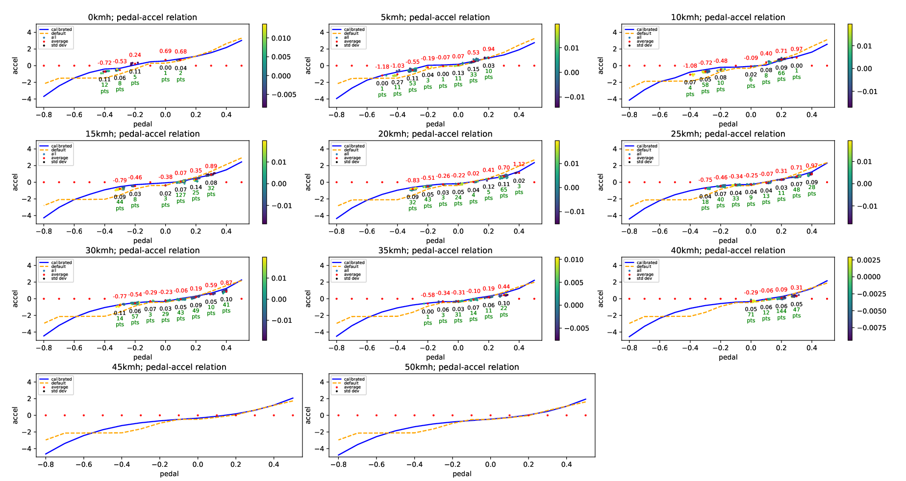
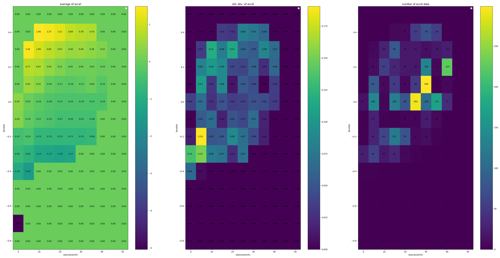

# accel_brake_map_calibrator

The role of this node is to automatically calibrate `accel_map.csv` / `brake_map.csv` used in the `autoware_raw_vehicle_cmd_converter` node.

The base map, which is lexus's one by default, is updated iteratively with the loaded driving data.

## How to calibrate

### Launch Calibrator

After launching Autoware, run the `accel_brake_map_calibrator` by the following command and then perform autonomous driving. Note: You can collect data with manual driving if it is possible to use the same vehicle interface as during autonomous driving (e.g. using a joystick).

```sh
ros2 launch accel_brake_map_calibrator accel_brake_map_calibrator.launch.xml rviz:=true
```

Or if you want to use rosbag files, run the following commands.

```sh
ros2 launch accel_brake_map_calibrator accel_brake_map_calibrator.launch.xml rviz:=true use_sim_time:=true
ros2 bag play <rosbag_file> --clock
```

During the calibration with setting the parameter `progress_file_output` to true, the log file is output in [directory of *accel_brake_map_calibrator*]/config/ . You can also see accel and brake maps in [directory of *accel_brake_map_calibrator*]/config/accel_map.csv and [directory of *accel_brake_map_calibrator*]/config/brake_map.csv after calibration.

### Calibration plugin

The `rviz:=true` option displays the RViz with a calibration plugin as below.

<p align="center">

</p>

The current status (velocity and pedal) is shown in the plugin. The color on the current cell varies green/red depending on the current data is valid/invalid. The data that doesn't satisfy the following conditions are considered invalid and will not be used for estimation since aggressive data (e.g. when the pedal is moving fast) causes bad calibration accuracy.

- The velocity and pedal conditions are within certain ranges from the index values.
- The steer value, pedal speed, pitch value, etc. are less than corresponding thresholds.
- The velocity is higher than a threshold.

The detailed parameters are described in the parameter section.

Note: You don't need to worry about whether the current state is red or green during calibration. Just keep getting data until all the cells turn red.

The value of each cell in the map is gray at first, and it changes from blue to red as the number of valid data in the cell accumulates. It is preferable to continue the calibration until each cell of the map becomes close to red. In particular, the performance near the stop depends strongly on the velocity of 0 ~ 6m/s range and the pedal value of +0.2 ~ -0.4, range so it is desirable to focus on those areas.

### Diagnostics

The `accel brake map_calibrator` publishes diagnostics message depending on the calibration status.
Diagnostic type `WARN` indicates that the current accel/brake map is estimated to be inaccurate. In this situation, it is strongly recommended to perform a re-calibration of the accel/brake map.

| Status                  | Diagnostics Type | Diagnostics message                        | Description                                         |
| ----------------------- | ---------------- | ------------------------------------------ | --------------------------------------------------- |
| No calibration required | `OK`             | "OK"                                       |                                                     |
| Calibration Required    | `WARN`           | "Accel/brake map Calibration is required." | The accuracy of current accel/brake map may be low. |

This diagnostics status can be also checked on the following ROS topic.

```sh
ros2 topic echo /accel_brake_map_calibrator/output/update_suggest
```

When the diagnostics type is `WARN`, `True` is published on this topic and the update of the accel/brake map is suggested.

### Evaluation of the accel / brake map accuracy

The accuracy of map is evaluated by the **Root Mean Squared Error (RMSE)** between the observed acceleration and predicted acceleration.

**TERMS:**

- `Observed acceleration`: the current vehicle acceleration which is calculated as a derivative value of the wheel speed.

- `Predicted acceleration`: the output of the original accel/brake map, which the Autoware is expecting. The value is calculated using the current pedal and velocity.

You can check additional error information with the following topics.

- `/accel_brake_map_calibrator/output/current_map_error` : The error of the original map set in the `csv_path_accel/brake_map` path. The original map is not accurate if this value is large.
- `/accel_brake_map_calibrator/output/updated_map_error` : The error of the map calibrated in this node. The calibration quality is low if this value is large.
- `/accel_brake_map_calibrator/output/map_error_ratio` : The error ratio between the original map and updated map (ratio = updated / current). If this value is less than 1, it is desirable to update the map.

### How to visualize calibration data

The process of calibration can be visualized as below. Since these scripts need the log output of the calibration, the `pedal_accel_graph_output` parameter must be set to true while the calibration is running for the visualization.

#### Visualize plot of relation between acceleration and pedal

The following command shows the plot of used data in the calibration. In each plot of velocity ranges, you can see the distribution of the relationship between pedal and acceleration, and raw data points with colors according to their pitch angles.

```sh
ros2 run accel_brake_map_calibrator view_plot.py
```



#### Visualize statistics about acceleration/velocity/pedal data

The following command shows the statistics of the calibration:

- mean value
- standard deviation
- number of data

of all data in each map cell.

```sh
ros2 run accel_brake_map_calibrator view_statistics.py
```



### How to save the calibrated accel / brake map anytime you want

You can save accel and brake map anytime with the following command.

```sh
ros2 service call /accel_brake_map_calibrator/update_map_dir tier4_vehicle_msgs/srv/UpdateAccelBrakeMap "path: '<accel/brake map directory>'"
```

You can also save accel and brake map in the default directory where Autoware reads accel_map.csv/brake_map.csv using the RViz plugin (AccelBrakeMapCalibratorButtonPanel) as following.

1. Click _Panels_ tab, and select AccelBrakeMapCalibratorButtonPanel.

   

2. Select the panel, and the button will appear at the bottom of RViz.

   

3. Press the button, and the accel / brake map will be saved.
   (The button cannot be pressed in certain situations, such as when the calibrator node is not running.)

   

## Parameters

## System Parameters

| Name                     | Type   | Description                                                                                                                                                                       | Default value                                                     |
| :----------------------- | :----- | :-------------------------------------------------------------------------------------------------------------------------------------------------------------------------------- | :---------------------------------------------------------------- |
| update_method            | string | you can select map calibration method. "update_offset_each_cell" calculates offsets for each grid cells on the map. "update_offset_total" calculates the total offset of the map. | "update_offset_each_cell"                                         |
| get_pitch_method         | string | "tf": get pitch from tf, "none": unable to perform pitch validation and pitch compensation                                                                                        | "tf"                                                              |
| pedal_accel_graph_output | bool   | if true, it will output a log of the pedal accel graph.                                                                                                                           | true                                                              |
| progress_file_output     | bool   | if true, it will output a log and csv file of the update process.                                                                                                                 | false                                                             |
| default_map_dir          | str    | directory of default map                                                                                                                                                          | [directory of *autoware_raw_vehicle_cmd_converter*]/data/default/ |
| calibrated_map_dir       | str    | directory of calibrated map                                                                                                                                                       | [directory of *accel_brake_map_calibrator*]/config/               |
| update_hz                | double | hz for update                                                                                                                                                                     | 10.0                                                              |

## Algorithm Parameters

| Name                     | Type   | Description                                                                                                                                         | Default value |
| :----------------------- | :----- | :-------------------------------------------------------------------------------------------------------------------------------------------------- | :------------ |
| initial_covariance       | double | Covariance of initial acceleration map (larger covariance makes the update speed faster)                                                            | 0.05          |
| velocity_min_threshold   | double | Speeds smaller than this are not used for updating.                                                                                                 | 0.1           |
| velocity_diff_threshold  | double | When the velocity data is more than this threshold away from the grid reference speed (center value), the associated data is not used for updating. | 0.556         |
| max_steer_threshold      | double | If the steer angle is greater than this value, the associated data is not used for updating.                                                        | 0.2           |
| max_pitch_threshold      | double | If the pitch angle is greater than this value, the associated data is not used for updating.                                                        | 0.02          |
| max_jerk_threshold       | double | If the ego jerk calculated from ego acceleration is greater than this value, the associated data is not used for updating.                          | 0.7           |
| pedal_velocity_thresh    | double | If the pedal moving speed is greater than this value, the associated data is not used for updating.                                                 | 0.15          |
| pedal_diff_threshold     | double | If the current pedal value is more then this threshold away from the previous value, the associated data is not used for updating.                  | 0.03          |
| max_accel                | double | Maximum value of acceleration calculated from velocity source.                                                                                      | 5.0           |
| min_accel                | double | Minimum value of acceleration calculated from velocity source.                                                                                      | -5.0          |
| pedal_to_accel_delay     | double | The delay time between actuation_cmd to acceleration, considered in the update logic.                                                               | 0.3           |
| update_suggest_thresh    | double | threshold of RMSE ratio that update suggest flag becomes true. ( RMSE ratio: [RMSE of new map] / [RMSE of original map] )                           | 0.7           |
| max_data_count           | int    | For visualization. When the data num of each grid gets this value, the grid color gets red.                                                         | 100           |
| accel_brake_value_source | string | Whether to use actuation_status or actuation_command as accel/brake sources. value                                                                  | status        |

## Test utility scripts

### Constant accel/brake command test

These scripts are useful to test for accel brake map calibration. These generate an `ActuationCmd` with a constant accel/brake value given interactively by a user through CLI.

- accel_tester.py
- brake_tester.py
- actuation_cmd_publisher.py

The `accel/brake_tester.py` receives a target accel/brake command from CLI. It sends a target value to `actuation_cmd_publisher.py` which generates the `ActuationCmd`. You can run these scripts by the following commands in the different terminals, and it will be as in the screenshot below.

```bash
ros2 run accel_brake_map_calibrator accel_tester.py
ros2 run accel_brake_map_calibrator brake_tester.py
ros2 run accel_brake_map_calibrator actuation_cmd_publisher.py
```


## Calibration Method

Two algorithms are selectable for the acceleration map update, [update_offset_four_cell_around](#update_offset_four_cell_around-1) and [update_offset_each_cell](#update_offset_each_cell). Please see the link for details.

### Data Preprocessing

Before calibration, missing or unusable data (e.g., too large handle angles) must first be eliminated. The following parameters are used to determine which data to remove.

#### Parameters

| Name                   | Description                  | Default Value |
| ---------------------- | ---------------------------- | ------------- |
| velocity_min_threshold | Exclude minimal velocity     | 0.1           |
| max_steer_threshold    | Exclude large steering angle | 0.2           |
| max_pitch_threshold    | Exclude large pitch angle    | 0.02          |
| max_jerk_threshold     | Exclude large jerk           | 0.7           |
| pedal_velocity_thresh  | Exclude large pedaling speed | 0.15          |

### update_offset_each_cell

Update by Recursive Least Squares(RLS) method using data close enough to each grid.

**Advantage** : Only data close enough to each grid is used for calibration, allowing accurate updates at each point.

**Disadvantage** : Calibration is time-consuming due to a large amount of data to be excluded.

#### Parameters

Data selection is determined by the following thresholds.
| Name | Default Value |
| ----------------------- | ------------- |
| velocity_diff_threshold | 0.556 |
| pedal_diff_threshold | 0.03 |

#### Update formula

$$
\begin{align}
    \theta[n]=&
    \theta[n-1]+\frac{p[n-1]x^{(n)}}{\lambda+p[n-1]{(x^{(n)})}^2}(y^{(n)}-\theta[n-1]x^{(n)})\\
    p[n]=&\frac{p[n-1]}{\lambda+p[n-1]{(x^{(n)})}^2}
\end{align}
$$

#### Variables

| Variable name      | Symbol      |
| ------------------ | ----------- |
| covariance         | $p[n-1]$    |
| map_offset         | $\theta[n]$ |
| forgetting*factor* | $\lambda$   |
| phi                | $x(=1)$     |
| measured_acc       | $y$         |

### update_offset_four_cell_around [1]

Update the offsets by RLS in four grids around newly obtained data. By considering linear interpolation, the update takes into account appropriate weights. Therefore, there is no need to remove data by thresholding.

**Advantage** : No data is wasted because updates are performed on the 4 grids around the data with appropriate weighting.
**Disadvantage** : Accuracy may be degraded due to extreme bias of the data. For example, if data $z(k)$ is biased near $Z_{RR}$ in Fig. 2, updating is performed at the four surrounding points ( $Z_{RR}$, $Z_{RL}$, $Z_{LR}$, and $Z_{LL}$), but accuracy at $Z_{LL}$ is not expected.

<!-- cspell: ignore fourcell -->
<p align="center">
  
</p>

#### Implementation

See eq.(7)-(10) in [1] for the updated formula. In addition, eq.(17),(18) from [1] are used for Anti-Windup.

### References

<!-- cspell: ignore Lochrie, Doljevic, Yongsoon, Yoon, IFAC -->

[1] [Gabrielle Lochrie, Michael Doljevic, Mario Nona, Yongsoon Yoon, Anti-Windup Recursive Least Squares Method for Adaptive Lookup Tables with Application to Automotive Powertrain Control Systems, IFAC-PapersOnLine, Volume 54, Issue 20, 2021, Pages 840-845](https://www.sciencedirect.com/science/article/pii/S240589632102320X)
